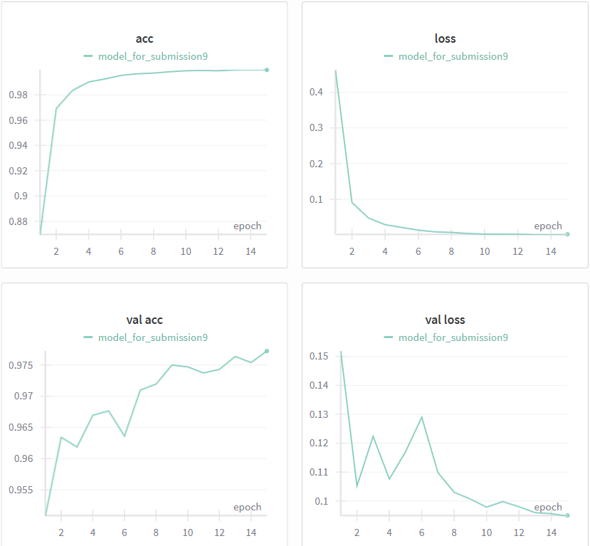
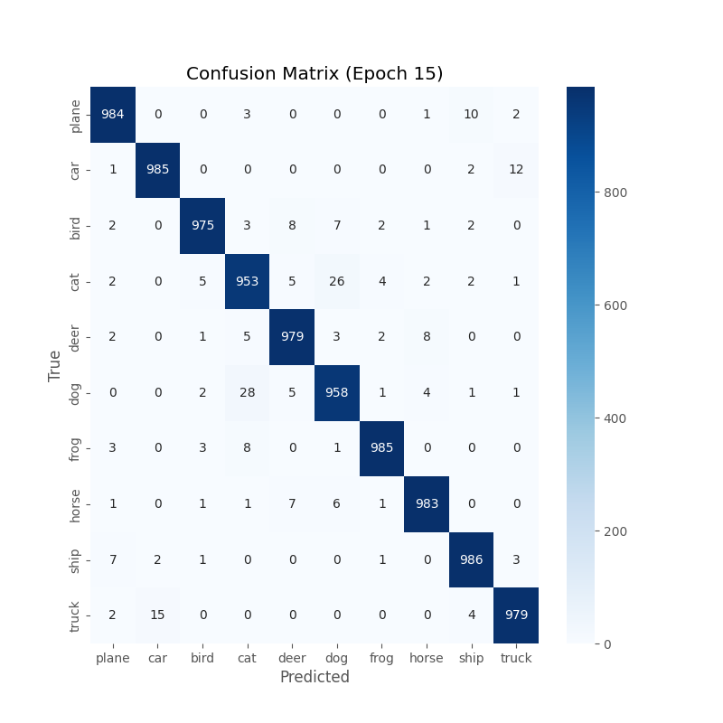

# CIFAR-10 Classification with ResNet50


このリポジトリは、データセット**CIFAR-10**に対して**ResNet50**を用いた画像分類モデルを実装し、各種改善施策(データ拡張・正則化・転移学習・学習率調整)を検証するためのコード一式をまとめたものです。

## 実験結果

転移学習（全層ファインチューニング）と学習率スケジューリングなどの導入により、検証データの精度をかなり高めることができました。

| モデル設定 | Epochs | 手法 | Best Val Acc |
| :--- | :---: | :--- | :---: |
| Baseline (scratch) | 15 | スクラッチ学習・正規化のみ | 67.2% |
| **Final Model** | **12** | **データ拡張・正則化 + 全層FT + CosineScheduler** | **97.7%**|

### 学習曲線の推移


*図1: 最終モデルにおけるAccuracyとLossの推移*

### 混同行列 (Confusion Matrix)


*図2: クラスごとの予測精度。CatとDogの間でわずかな誤分類が見られるものの、全体として極めて高い分類能力を示している。*


## 環境構築
- python 3.10以降

- pytorch/torchvision

- WandB (ログ管理用)

必要なライブラリは`requirements.txt`をご参照ください。


### ディレクトリ構成

```text
.
├── train.py           # 学習用スクリプト
├── predict.py         # 推論用スクリプト
├── requirements.txt   # 依存ライブラリ
├── README.md          # ドキュメント
├── images/            # 実験結果の画像（グラフなど）
│   ├── loss_accuracy_curve.png
│   └── confusion_matrix.png
├── notebooks/         # 実験用ノートブック（全９ファイル）
├── weights/           # 学習済みモデル
│   └── best_model.pth
└── slides/
    └── report.pdf     # レポート用スライド（後で追加）
```

### インストール手順

```
# リポジトリのクローン
git clone https://github.com/so-hamaguchi/cifar10-resnet50-assignment.git
cd cifar10-resnet50-assignment

# 必要なライブラリのインストール
pip install -r requirements.txt
```

## 学習実行手順
- デフォルト実行

```
python train.py
```

- W&Bにログを記録したい場合（任意）

```
# W&Bにログイン
wandb login

python train.py --use_wandb

# --log_imagesとすると誤分類画像が毎エポック記録されます。必要な場合はご使用ください。
```

- ハイパーパラメータの変更

```
#例（random_seedはデフォルトで42です）
python train.py --epochs 12 --batch_size 64 --seed 42
```

### 出力
`python train.py` の実行後、以下が自動生成されます。

- `outputs/checkpoints/resnet50_cifar10.pth`（学習済み重み）
- `outputs/log.csv`（各epochの指標）
- `outputs/figures/`（混同行列など：W&B無効時）

推論の際に重みを使用される場合はパスの変更をお願いします。


## 推論実行手順

学習済みモデルを使用して、画像のクラス分類を行います。

```
# 実行例
python predict.py --image samples/cat.jpg --weights weights/best_model.pth

# --deviceでcpu/cudaが選べます。デフォルトはautoです。
```

